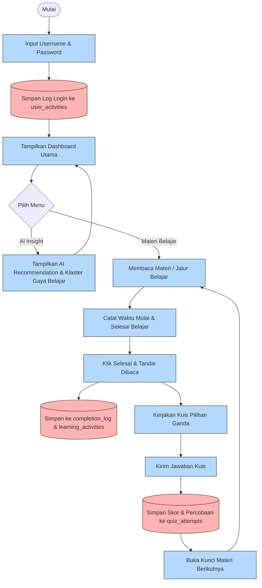

# Perbaikan Flowchart Aplikasi Edusight

Berikut adalah kode rancangan **Mermaid Diagram** untuk flowchart Edusight yang sudah diperbaiki. 

Rancangan ini **mempertahankan seluruh kotak asli** dari gambar `flowchart_aplikasi.png` Anda dan hanya mengubah jalur hubungannya (koneksi) serta menyisipkan log login di bagian atas agar logikanya 100% benar untuk skripsi.

---

## 📊 Kode Flowchart Hasil Perbaikan (Mermaid)

---

## 🔧 Ringkasan Perubahan dari Flowchart Asli Anda:

1.  **Ditambahkan di Awal:** Kotak database **`Simpan Log Login ke user_activities`** ditambahkan tepat sebelum masuk ke *Tampilkan Dashboard Utama*.
2.  **Digabungkan secara Berurutan:** Kotak **`Kerjakan Kuis Pilihan Ganda`** yang tadinya berdiri sejajar di kolom kanan, kini diletakkan di bawah kotak **`Klik Selesai & Tandai Dibaca`** karena kuis hanya bisa diakses setelah materi bab selesai dibaca.
3.  **Panah Kembali ke Materi:** Kotak **`Buka Kunci Materi Berikutnya`** di bagian akhir kini memiliki panah kembali ke **`Membaca Materi / Jalur Belajar`** (bukan ke Dashboard utama) agar siswa bisa langsung memilih bab berikutnya yang baru terbuka.
