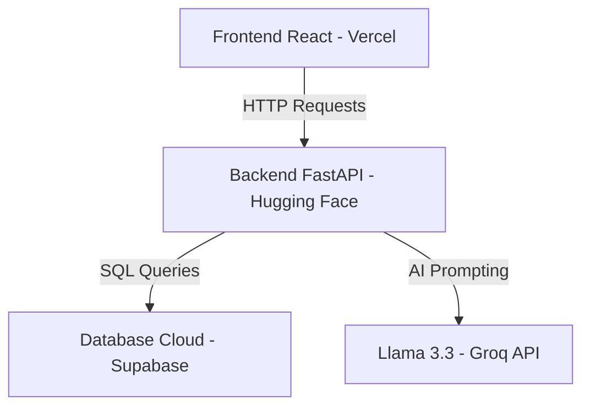

# Panduan Deployment & Ekspor Data — Edusight

Dokumen ini berisi panduan teknis mengenai arsitektur produksi (cloud) platform Edusight serta tata cara melakukan ekspor data hasil belajar untuk kebutuhan lampiran skripsi atau analisis data.

---

## 📁 1. Arsitektur Produksi (Cloud) Edusight

Platform Edusight berjalan secara penuh di internet dengan membagi sistem menjadi 3 bagian utama:



1.  **Database (Supabase PostgreSQL):** 
    Menyimpan seluruh data pengguna, materi, log aktivitas belajar, gaya belajar, dan hasil kuis.
2.  **Backend & Machine Learning (Hugging Face Spaces):** 
    Menjalankan logika program Python FastAPI, algoritma K-Means Clustering, dan integrasi Groq LLM. Berjalan menggunakan Docker kontainer.
3.  **Frontend Tampilan (Vercel):** 
    Menyajikan antarmuka pengguna berbasis React + Vite yang diakses langsung oleh siswa dan dosen.

---

## 🛠️ 2. Dokumentasi Langkah Deployment

### A. Backend FastAPI (Hugging Face Spaces)
*   **Platform:** Hugging Face Spaces (Docker SDK - Blank template).
*   **Port Default Kontainer:** `7860` (Wajib untuk Hugging Face).
*   **Kapasitas Server:** CPU Basic (2 vCPU, 16 GB RAM - Free).
*   **Langkah Git Deploy:**
    ```bash
    cd backend
    git init
    git add .
    git commit -m "deploy backend to Hugging Face"
    git branch -M main
    git remote add huggingface https://huggingface.co/spaces/atalahabid19/edusight
    git push -u huggingface main -f
    ```
    *(Gunakan username GitHub/HuggingFace Anda dan masukkan **Write Access Token** Hugging Face sebagai password-nya).*

*   **Environment Variables (Space Secrets):**
    Diatur di menu **Settings -> Variables and secrets -> Space Secrets**:
    *   `DATABASE_URL`: URL PostgreSQL Supabase Anda.
    *   `SECRET_KEY`: Kunci enkripsi token JWT Anda.
    *   `GROQ_MODEL`: `llama-3.3-70b-versatile`
    *   `INSIGHT_MIN_COMPLETIONS`: `1`
    *   `GROQ_API_KEY_1` s/d `GROQ_API_KEY_5`: Token API dari Groq untuk Multi-Key Fallback.
    *   `CORS_ORIGINS`: `https://edusight-six.vercel.app,http://localhost:5173` (mengizinkan akses dari domain frontend).

---

### B. Frontend React (Vercel)
*   **Platform:** Vercel.
*   **Konfigurasi Proyek:**
    *   **Root Directory:** `frontend/` (Hanya deploy subfolder frontend).
    *   **Framework Preset:** `Vite`.
    *   **Environment Variable:** `VITE_API_URL` bernilai `https://atalahabid19-edusight.hf.space`.
*   **Penanganan Refresh SPA (F5 Redirect):**
    Menggunakan berkas `frontend/vercel.json` untuk menghindari error 404:
    ```json
    {
      "rewrites": [
        {
          "source": "/(.*)",
          "destination": "/index.html"
        }
      ]
    }
    ```

---

## 📊 3. Panduan Ekspor Data untuk Skripsi

Aplikasi Edusight menyediakan fitur bawaan untuk mengekspor data hasil belajar siswa ke format **Excel (.xlsx)**. File ini sangat berguna sebagai data mentah lampiran skripsi Anda.

### Cara Melakukan Ekspor Data:
1.  Buka browser dan akses API Dokumentasi Swagger backend Anda di:
    👉 **`https://atalahabid19-edusight.hf.space/docs`**
2.  Gulir ke bagian **`export`** di bagian bawah daftar API routes.
3.  Di sana terdapat endpoint berikut:
    *   **`GET /api/export/excel`**: Mengekspor seluruh data aktivitas belajar siswa, hasil kuis, dan klaster gaya belajar K-Means ke dalam satu berkas Excel terstruktur.
4.  Klik tombol **`Try it out`**, lalu klik **`Execute`**.
5.  Swagger akan menghasilkan file unduhan. Klik tombol **`Download file`** yang muncul untuk menyimpannya ke komputer Anda.
